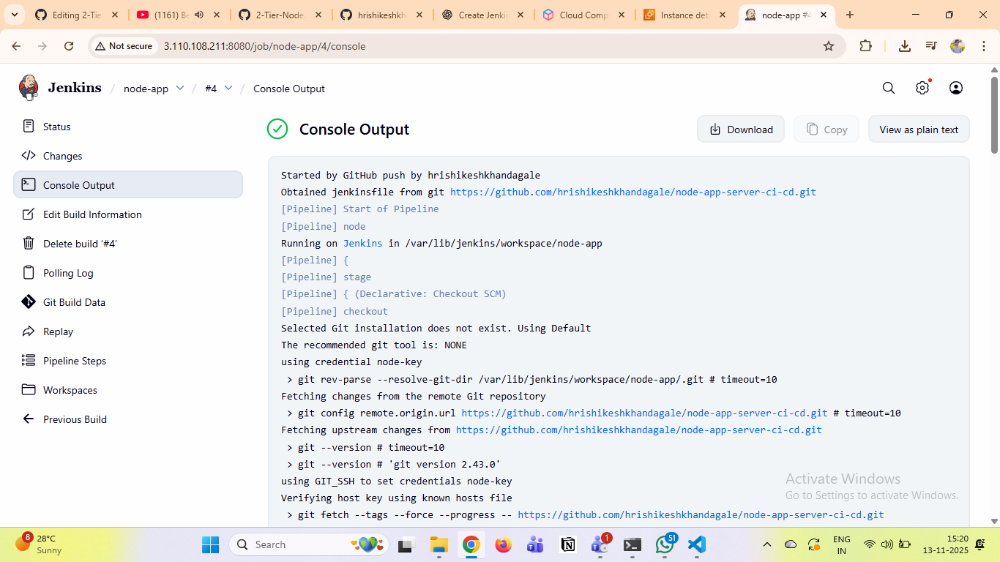
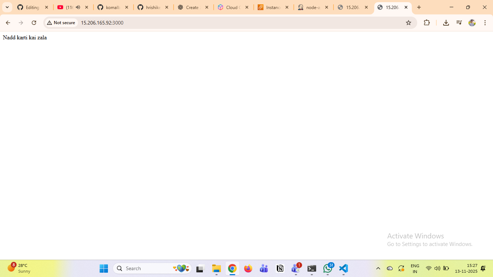

# node-app-server-ci-cd
This project demonstrates the deployment of a  web application using Docker containers.
It consists of:

- Node.js App Container (Backend)

- Nginx Proxy Container (Frontend/Reverse Proxy)
The setup includes two tiers:

1. Application Tier (Node.js):
Handles application logic and runs on port 3000 inside the container.


Step 1: Create a Dockerfile

Create a new file named Dockerfile using vim:
```bash
vim Dockerfile
```

Add the following content:


### 🧩 Step 3: Create Jenkinsfile

In this step, we will create a Jenkinsfile to define our CI/CD pipeline for the Java project.
This file contains all the stages like code checkout, build, test, and deployment. 

pipeline {
    agent any

    environment {
        SERVER_IP      = '65.2.79.97'
        SSH_CREDENTIAL = 'node-key'
        REPO_URL       = 'https://github.com/hrishikeshkhandagale/node-app-server-ci-cd.git'
        BRANCH         = 'main'
        REMOTE_USER    = 'ubuntu'
        REMOTE_PATH    = '/home/ubuntu/node-app'
    }

    stages {
        stage('Clone Repository') {
            steps {
                git branch: "${BRANCH}", url: "${REPO_URL}"
            }
        }

        stage('Upload Files to EC2') {
            steps {
                sshagent([SSH_CREDENTIAL]) {
                    sh """
                        ssh -o StrictHostKeyChecking=no ${REMOTE_USER}@${SERVER_IP} 'mkdir -p ${REMOTE_PATH}'
                        scp -o StrictHostKeyChecking=no -r * ${REMOTE_USER}@${SERVER_IP}:${REMOTE_PATH}/
                    """
                }
            }
        }

        stage('Install Dependencies & Start App') {
            steps {
                sshagent([SSH_CREDENTIAL]) {
                    sh """
                        ssh -o StrictHostKeyChecking=no ${REMOTE_USER}@${SERVER_IP} '
                            cd ${REMOTE_PATH} &&
                            sudo npm install &&
                            sudo pm2 start app.js --name node-app || pm2 restart node-app
                        '
                    """
                }
            }
        }
    }

    post {
        success {
            echo '✅ Application deployed successfully!'
        }
        failure {
            echo '❌ Deployment failed.'
        }
    }
}

# Step 4: Create Jenkins Pipeline Job

In this step, we will create a Pipeline Job in Jenkins to automate the build and deployment process using the Jenkinsfile we created earlier.

🪜 Follow the steps below:

### 1)Open Jenkins Dashboard
Log in to your Jenkins server (e.g. http://<your-server-ip>:8080)

Create a New Job

### 2)Click on “New Item”

Enter a project name (for example: java-maven-pipeline)

Select “Pipeline” and click OK

### 3)Configure the Pipeline Job

In the Description, add details like “This job builds and deploys Java app to Tomcat using Maven”

Under Pipeline → Definition, select “Pipeline script from SCM”

SCM: Git

Repository URL:

https://github.com/hrishikeshkhandagale/node-app-server-ci-cd.git
Branch: master
Script Path: Jenkinsfile


### 4)Save and Build

Click Apply → Save

Then click Build Now

Jenkins will automatically pull the code, build the project, run tests, and deploy it 🚀



### Step 5: Test the Setup

Open your browser and visit:
👉 http://13.127.253.139:3000

